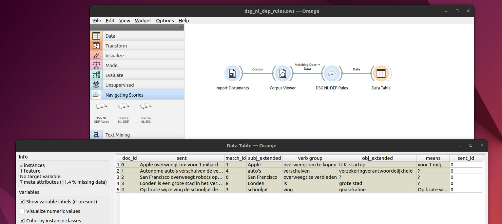

Digital Story Grammar (DSG) Add-on for Orange3
==============================================

This add-on for Orange3 enables digital story grammar (DSG) analysis of Dutch texts. Please see the following paper for more information on DSG: [Andrade and Andersen (2020)](https://www.tandfonline.com/doi/full/10.1080/13645579.2020.1723205)

Requirements
------------
The following versions of Python and Orange3 were used:

+ Python v3.8.3
+ Orange3 v3.32.0
+ Orange3-text v1.7.0

Installation
------------

To install the add-on from source, clone this repo, `cd` into the root directory and run

    pip install -r requirements.txt
    pip install .

To make this add-on known to your local Orange without copying the code it to Python's site-packages directory, run

    pip install -e .

Usage
-----

After the installation, the widget from this add-on is registered with Orange. To run Orange from the terminal,
use

    orange-canvas

or

    python -m Orange.canvas

Here is an example pipeline:

The widget Import Documents (from Text Mining) will read text files from a 
directory. The widget Corpus Viewer (from Text Mining) can be used making 
a selection of the files. The widget DSG NL DEP Rules (from Navigating 
Stories) processes the text files. The results of the analysis can be
inspected with the Data Table widget (from Data).

