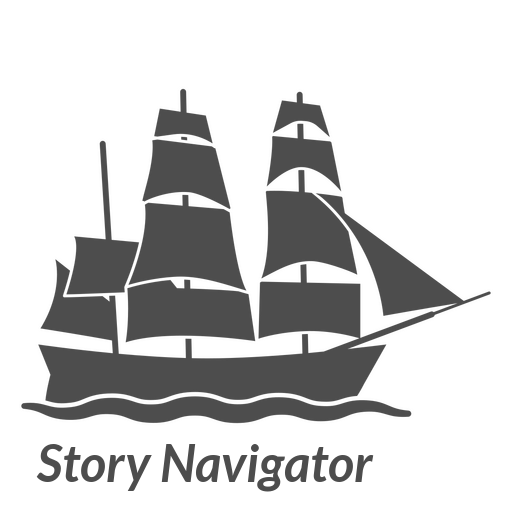

[](https://badge.fury.io/py/storynavigator)
[](https://orange-story-navigator.readthedocs.io/en/latest/)



[Orange3](https://github.com/biolab/orange3) Story Navigator
=======================

Orange3-Story-Navigator is an add-on for the [Orange data mining software package](https://orangedatamining.com/). It
provides quantitative textual story analysis features based on principles in [narrative psychology](https://web.lemoyne.edu/~hevern/narpsych/nr-basic.html). The aim of the Story Navigator is to support human analysis of stories represented in digital texts, with a focus on identifying and describing the following components of the narrative (see [[1]](http://www.communicationcache.com/uploads/1/0/8/8/10887248/kenneth_burke_-_a_grammar_of_motives_1945.pdf), [[2]](https://www.semanticscholar.org/paper/Qualitative-Research-in-Clinical-and-Health-Murray-Sools/8db3916fcd1593086f0a62d78d15eacc2d3236e6) and [[3]](https://www.tandfonline.com/doi/abs/10.1080/13645579.2020.1723205?journalCode=tsrm20) for definitions and theory):

1. Setting
2. Main agent
3. Means
4. Acts and events
5. Purpose
6. Breach

[1] Burke, K. (1969). The grammar of motives. Prentice Hall, New York. Originally published in 1945.

[2] M. Murray and A. Sools, P. Rohleder, A.C. Lyons (Eds.), Qualitative research in clinical and health psychology, Palgrave MacMillan, Houndmills Basingstoke (2015), pp. 133-154

[3] Andrade, S. B., & Andersen, D. (2020). Digital story grammar: a quantitative methodology for narrative analysis. International Journal of Social Research Methodology, 23(4), 405-421.

## Installation

This section is for those who want to install the Story Navigator purely for analysing stories with **no** plan to develop or extend the add-on.

#### Method 1

> Requirements:
>
> 1. [Orange3](https://github.com/biolab/orange3)
> 2. [Orange3-text](https://github.com/biolab/orange3-text)
> 3. [Orange3-network](https://github.com/biolab/orange3-network)
>
> Steps:
>
> 1. First install [Orange](https://orangedatamining.com/). Instructions are [here](https://orangedatamining.com/download)
> 2. Fire up Orange, navigate to the Orange add-on installer which is available in the Options -> Add-ons menu. **Note:** the add-on requires [Orange3-text](https://github.com/biolab/orange3-text) and [Orange3-network](https://github.com/biolab/orange3-network) so first install these libraries before installing ``storynavigator``.
> 3. Click on the ``Add more...`` button on the top right of the window
> 4. Type in ``storynavigator`` in the textbox and click on the ``Add`` button
> 5. Click on the ``OK`` button
> 6. The ``storynavigator`` add-on should install and Orange may ask you to restart it to view the new add-ons. Click on the ``OK`` button to do so.

#### Method 2

> Requirements: [Python 3.9.12+](https://www.python.org/downloads/)
> 
> Step: ``pip install storynavigator``

## User documentation
Available [here](https://orange-story-navigator.readthedocs.io/en/latest/)

## Development

This section is for those who want to build the add-on from source and extend, customise, or fix bugs in it.
**Note:** Mac M1 (Apple silicon) users may encounter problems with building ``storynavigator`` using certain Python 3.8.x or 3.9.x versions and / or actually building or running these specific Python versions at all on your Mac. If you encounter such issues, it is recommended to install [Rosetta 2](https://osxdaily.com/2020/12/04/how-install-rosetta-2-apple-silicon-mac/) and always run the terminal using Rosetta 2 (see how to do the latter [here](https://www.courier.com/blog/tips-and-tricks-to-setup-your-apple-m1-for-development/)) for development tasks.

Requirements:

1. A tool for checking out a [Git](https://git-scm.com/) repository
2. Python 3.9.12+

Steps to build and test from source:

1. Get a copy of the code
    
    ```git clone git@github.com:navigating-stories/orange-story-navigator.git```

2. Change into the ```orange-story-navigator/``` directory
    
    ```cd orange-story-navigator```

3. Create and activate a new Python virtual environment using [virtualenv](https://packaging.python.org/en/latest/guides/installing-using-pip-and-virtual-environments/)

4. Run the following command

    ```pip install -r requirements.txt```

5. If Step 4. completed with no errors, run this command

    ```pip install -e .```

> This command installs the widget and registers it with your Orange3 installation. If you encountered an error during Step 4, file an [issue](https://github.com/navigating-stories/orange-story-navigator/issues) with the details and skip the remaining steps.

6. Run ```orange-canvas``` or ```python -m Orange.canvas```

The Orange3 application should shortly start up with a splash screen

## Collaborators
The Story Navigator is maintained by the [Netherlands eScience Center](https://www.esciencecenter.nl/) in collaboration with the [Faculty of Behavioural, Management and Social Sciences (BMS)](https://www.utwente.nl/en/bms/) at the [University of Twente](https://www.utwente.nl/en/).
