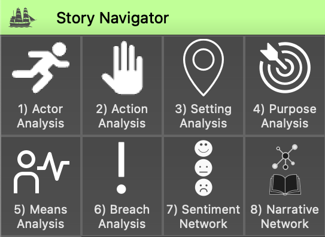

Orange3 Story Navigator Add-on
==============================

.. image:: ../orangecontrib/storynavigation/widgets/icons/storynavigator_logo.png
  :width: 200
  :alt: story navigator add-on all widgets

Story Navigator is an add-on for the `Orange3 data mining <http://orangedatamining.com>`_ platform which is able to analyse Dutch textual stories using the lenses of `narrative psychology <https://psycnet.apa.org/record/2003-04376-006>`_, `narrative analysis <https://www.annualreviews.org/doi/abs/10.1146/annurev.soc.24.1.517?casa_token=jcsMQx_jHUgAAAAA%3ACU6_eEEkFknTPrtI9dz4tohbcR0Ij04wEdriAmlFW3CFlZKe81NzqJY5dUKLvRJhWrSegYcUNJHKcYQ&casa_token=JFJOe8zjrGQAAAAA%3AgZ4K_j9JF5HS3CkenJ4jmJO1nfpBCVQhxXMUpfuF8dG8CVe564T6Ux6gr11sBUbd5tTY16DK3DHqYi0>`_, and narrative theory. It provides a series of Orange widgets to generate, analyse and visualise quantitative information about an individual or collection of stories written in the Dutch language. The add-on makes use of lexicographic analysis and natural language processing methods. It is inspired by ideas concerning the decomposition of textual narratives into `story elements <http://journals.sagepub.com/doi/full/10.1177/0081175012462370?casa_token=-FLZfJXKNwoAAAAA%3A0sYxlVEBKciRzS6HKne5ZeNx3k5zjMzKqCRIeG2Ra8sguV0lyo2nCpeeRKZzr5XnYtKLi7k9nq32pMY>`_ or `digital story grammar <http://www.tandfonline.com/doi/abs/10.1080/13645579.2020.1723205>`_.

Story Navigator is developed and maintained by the `Netherlands eScience Center <https://www.esciencecenter.nl/>`_ in collaboration with researchers at the `Department of Psychology, Health and Technology <https://www.utwente.nl/en/bms/pht>`_ at the `University of Twente <https://www.utwente.nl/en/>`_.

See the `Github repository <https://github.com/navigating-stories/orange-story-navigator>`_ for the source code and `licensing information <https://github.com/navigating-stories/orange-story-navigator?tab=License-1-ov-file#readme>`_.

Widgets
-------

.. toctree::
   :maxdepth: 1

   widgets/actoranalysis
   widgets/actionanalysis
   widgets/settinganalysis
   widgets/narrativenetwork
   
Indices and tables
==================

* :ref:`genindex`
* :ref:`modindex`
* :ref:`search`
