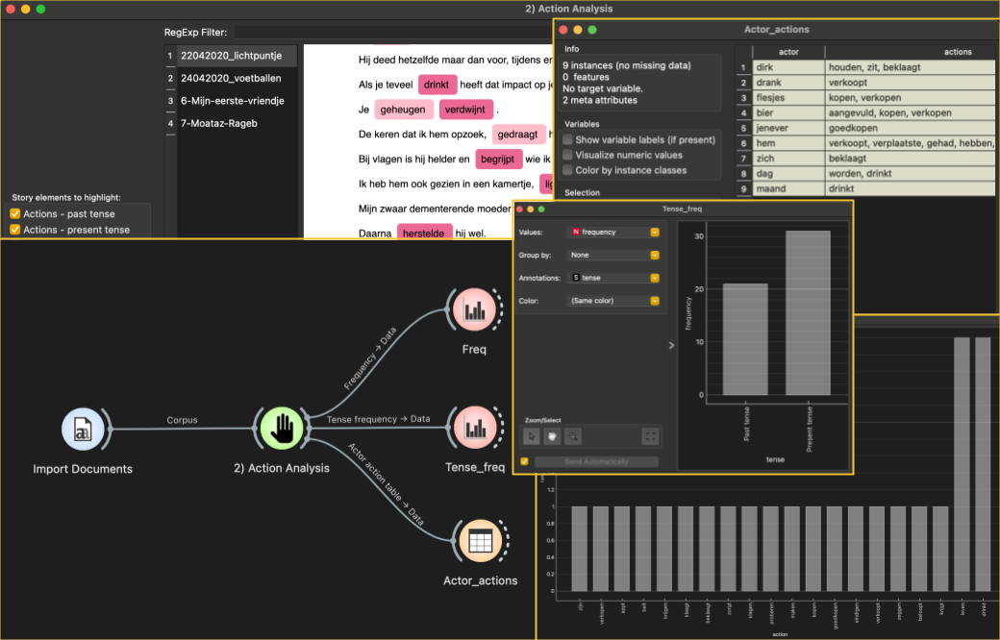

Actions
=======

An Orange3 widget to highlight present and past tense actions, calculate their frequency, and identify actors associated with those actions, within in a textual story written in the Dutch language.

**Inputs**

- Corpus: A dataset of one or more textual story documents in Dutch.
- Token categories (**optional**): a data table specifying one or more classification schemes of tokens or words. The table should consist of at least two columns. The first column is a list of words or tokens. All subsequent columns should contain strings which represent user-defined category labels for the corresponding word or token in the first column.

**Outputs**

- Frequency: A data table with exactly two columns. The first column is a list of actions mentioned in the input story. The second column is the number of times that action is mentioned in the story.
- Tense frequency: A data table with exactly two columns and two rows. The first column consists of two cells with string values "Past tense" and "Present tense". The second column contains the frequency (raw counts of actions belonging to each category in the first column).
- Custom token frequency (**optional**): A data table with exactly two columns. The first column is a list of words or tokens specified by the user. The second column is the number of times that word or token is mentioned in the story.
- Actor action table: A data table with exactly two columns. The first column is a list of actors mentioned in the input story. The second column is a comma-separated string where each token in between the commas represents an action which that corresponding was involved in in the context of the story.

Example usage:
--------------

