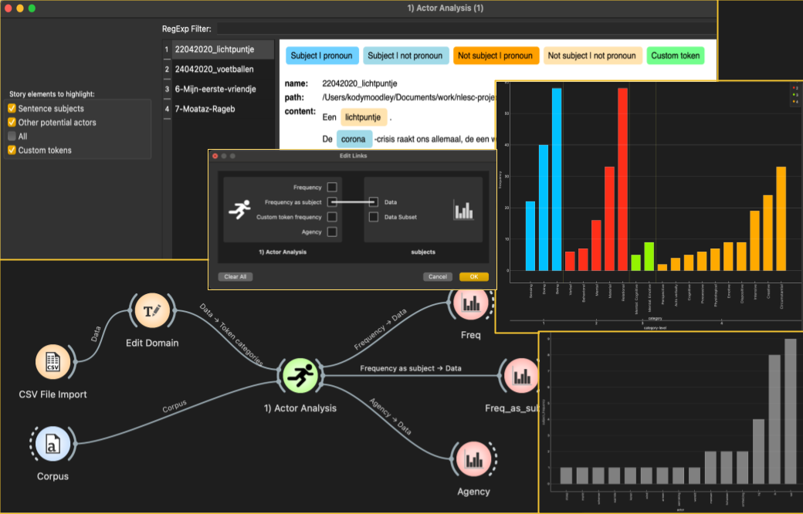

Actors
======

An Orange3 widget to highlight the main subjects of sentences as well as other potential actors or characters in a textual story written in the Dutch language.

**Inputs**

- Corpus: A dataset of one or more textual story documents in Dutch.
- Token categories (**optional**): a data table specifying one or more classification schemes of tokens or words. The table should consist of at least two columns. The first column is a list of words or tokens. All subsequent columns should contain strings which represent user-defined category labels for the corresponding word or token in the first column.

**Outputs**

- Frequency: A data table with exactly two columns. The first column is a list of actors mentioned in the input story. The second column is the number of times that actor is mentioned in the story.
- Frequency as subject: A data table with exactly two columns. The first column is a list of actors mentioned in the input story. The second column is the number of times that actor is mentioned as the main subject of a sentence in the story.
- Custom token frequency (**optional**): A data table with exactly two columns. The first column is a list of words or tokens specified by the user. The second column is the number of times that word or token is mentioned in the story.
- Agency: A data table with exactly two columns. The first column is a list of actors mentioned in the input story. The second column is a score for that actor representing its [agency](https://journals.sagepub.com/doi/full/10.1177/0081175012462370?casa_token=Lx4o-GJ8wbAAAAAA%3AbolGvtXBrf_Wa84jvVSd02kCt4rXwCGs108iqHk0LoXo1nRMPKnsZwhumUtArpnk_hvJzNiyO7nL5w) in the story

In all output data tables above, only the top 20 scores are given for each metric.

Example usage:
--------------

