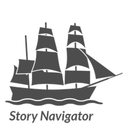

Contact Information
=======

The Story Navigator is maintained by the [Netherlands eScience Center](https://www.esciencecenter.nl/) in collaboration with the [Faculty of Behavioural, Management and Social Sciences (BMS)](https://www.utwente.nl/en/bms/) at the [University of Twente](https://www.utwente.nl/en/). If you have any questions, feedback, or need support, please feel free to reach out to us. Below are the primary contacts and useful links for your reference:

**General Inquiries**

For general questions and information, you can reach the Principal Investigator Prof. dr. Gerben J. Westerhof:
- **Email**: [g.j.westerhof@utwente.nl](mailto:g.j.westerhof@utwente.nl)
- **Phone**: +31.53.489.6074
- **Website**: https://personen.utwente.nl/g.j.westerhof

**Technical Support**

For technical support and troubleshooting, please contact our Lead Research Software Engineer Kody Moodley or visit the Orange Data Mining website for additional resources:
- **Email**: [k.moodley@esciencecenter.nl](mailto:k.moodley@esciencecenter.nl)
- **Orange**: [https://orangedatamining.com/](https://orangedatamining.com/)
- **Documentation**: [https://orange-story-navigator.readthedocs.io/en/latest/](https://orange-story-navigator.readthedocs.io/en/latest/)

**Collaboration**

If you are interested in contributing, reach out at:
- **Email**: [info@esciencecenter.nl](mailto:info@esciencecenter.nl)
- **Github**: [https://github.com/navigating-stories/orange-story-navigator](mailto:https://github.com/navigating-stories/orange-story-navigator)

**Follow Us**

Stay updated on the project by following us on:
- **RSD**: [Research Software Directory](https://research-software-directory.org/projects/navigating-stories)
- **LinkedIn**: [https://www.linkedin.com/company/netherlands-escience-center/](https://www.linkedin.com/company/netherlands-escience-center/)
- **Homepage**: [https://navigating-stories.github.io/](https://navigating-stories.github.io/)
- **Story Lab**: [https://www.utwente.nl/en/bms/ehealth/research/story-lab/](https://www.utwente.nl/en/bms/ehealth/research/story-lab/)

For more detailed information, visit our [official website](https://www.esciencecenter.nl/).

---

Thank you for your interest and support. We look forward to assisting you!