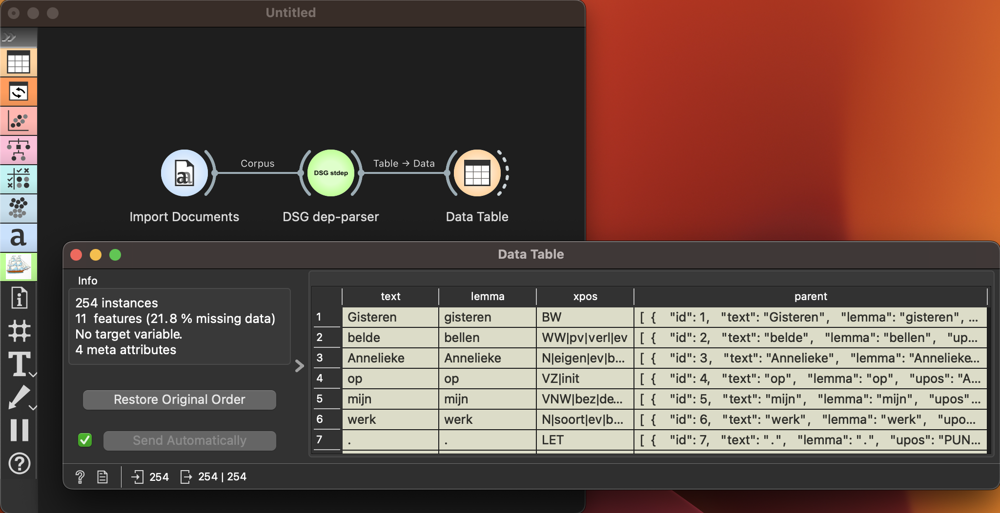

Dependency Parser
=================

NLP Dependency Parsing for Dutch and English.

**Inputs**

- Corpus: A dataset of one or more textual documents in Dutch or English.

**Outputs**

- Table: A data table providing all dependency information output from the parse tree.

**Dependency Parser** widget computes dependency parse tree for each sentence in given textual document (Dutch or English) and outputs a table storing all the information from the parse tree.

Example
-------

This simple example shows how **Dependency Parser** can enrich the workflow. We have used a dataset of Dutch narrative stories about the corona pandemic.