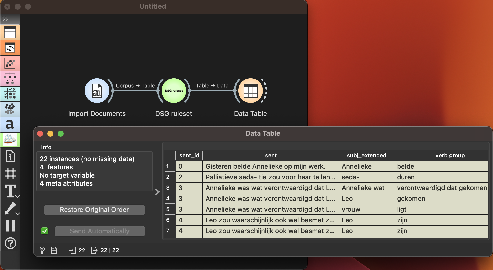

Ruleset Parser
==============

Calculation of subject, verb, object tuples in sentences using predefined NLP rules.

**Inputs**

- Corpus: A dataset of one or more textual documents in Dutch or English.

**Outputs**

- Table: A data table providing all subject, verb, object tuple information after applying NLP rules.

**Ruleset Parser** widget applies predefined NLP rules to decompose sentences into subject, verb, object components of narrative. It outputs a table storing all the tuple information.

Example
-------

This simple example shows how **Ruleset Parser** can enrich the workflow. We have used a dataset of Dutch narrative stories about the corona pandemic.