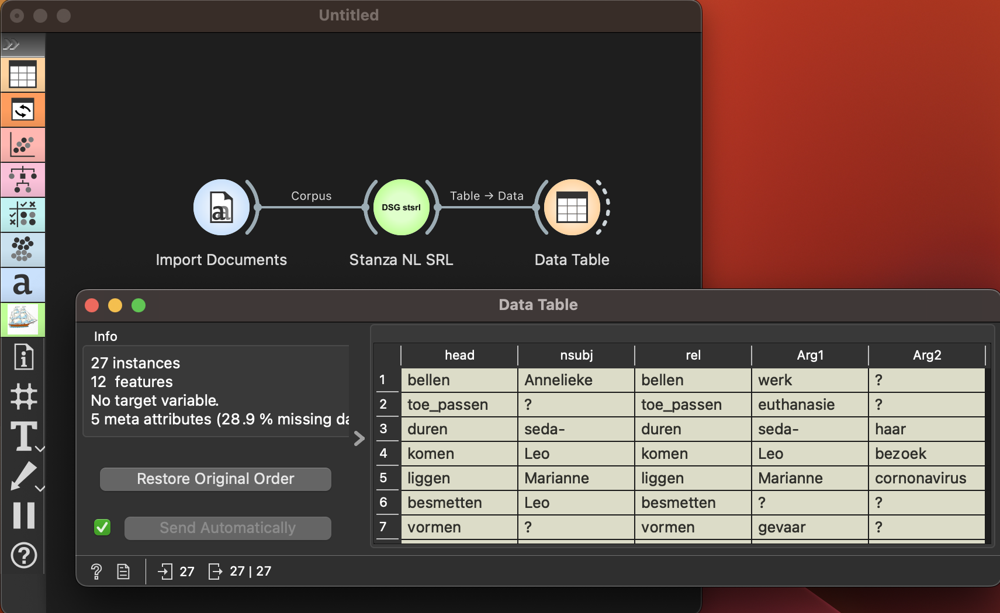

Semantic Role Labeller
======================

Semantic Role Labelling (SRL) for Dutch and English documents.

**Inputs**

- Corpus: A dataset of one or more textual documents in Dutch or English.

**Outputs**

- Table: A data table providing all frame information (subject, verb, object) tuples after performing SRL analysis. We use the implementation by Jisk Attema and Dafne van Kuppevelt at https://github.com/Filter-Bubble/stroll

**SRL Parser** widget applies SRL to decompose sentences into (subject, verb, object) components of narrative. It outputs a table storing all the tuple information.

Example
-------

This simple example shows how **SRL Parser** can enrich the workflow. We have used a dataset of Dutch narrative stories about the corona pandemic.