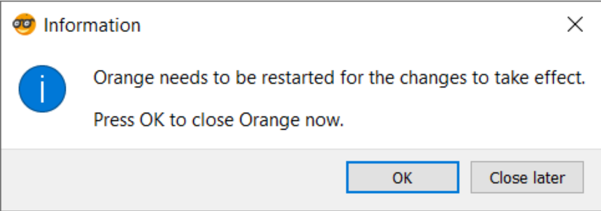

Installation
=======

To install the Orange3 StoryNavigator Add-on, use the following steps.

**Install and start Orange**

First, make sure to have installed the latest version of Orange3. If you haven't installed Orange3 yet, you can download it from the [Orange website](https://orange.biolab.si/download/).

**Open Add-on manager**

Additional features can be added to Orange by installing add-ons. After having opened Orange, go to the *options* menu at the top of the screen and select the *Add-ons* option. A dialog will open that will list and describe existing add-ons.

**Add storynavigator**

In the menu that appears, select *Add more*. Here, you can add an add-on by typing its name. Type *storynavigator* in the search bar, so that storynavigator appears in the list of add-ons. Finally, click the checkbox before storynavigator and finally click the *OK* button.

You will see a progress bar as the add-on is being installed (it may take a while, up to 10-15 minutes). When the installation is
completed you will see a dialog asking you to restart Orange. Click the *Restart* button.

This is not an automatic restart. You must close Orange and reopen the program.

**This completes your installation of Orange and the StoryNavigator Add-on.**