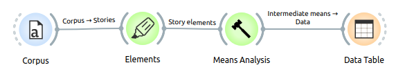
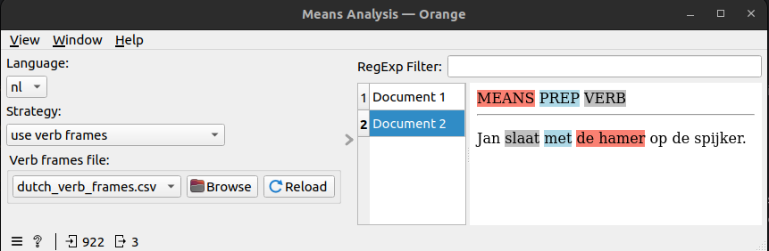
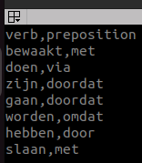
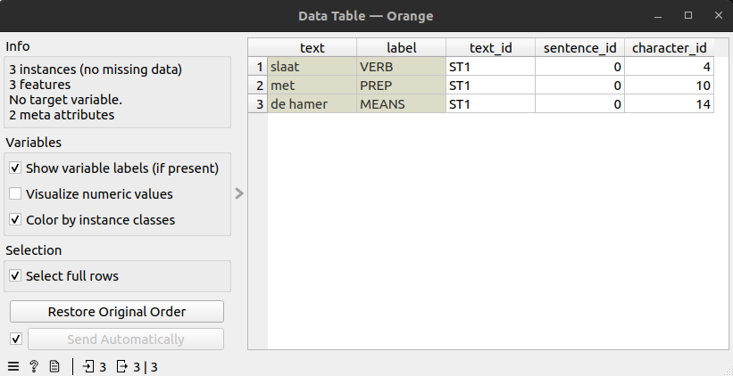

Means Analysis widget
=====================

**Introduction**

The Means Analysis widget can be used for finding the *means* in sentences in text. This corresponds with the concept of 
*agency* in [Burke's dramatistic pentad](https://en.wikipedia.org/wiki/Dramatistic_pentad#Agency) and with 
*[instrument case](https://en.wikipedia.org/wiki/Instrumental_case)* in linguistics. Here are two example sentences:

English: John hits the nail with 
the hammer
 Dutch: Jan slaat met 
de hamer op de spijker

In the English sentence, the instrument is *the hammer*. The instrument always correspondents with a verb (here: *hits*) 
and is linked to the verb by a preposition (here: *with*). The Means Analysis widget identifies all three related roles, 
marks them in its visualization and mentions them in its output table.

**Methods**

The identification of the linguistic instrument case requires a tool which can perform the task 
[semantic role labeling](https://en.wikipedia.org/wiki/Semantic_role_labeling). We do not have such a tool available, 
in particular not for the language Dutch. Instead, we use an approximation based on the syntactic analysis tool 
[Spacy](https://spacy.io/). The Means Analysis widget offers three strategies for finding instrument case:

1. predefined verb frames: these are user-defined pairs of verbs and prepositions which occur with instrument case
2. predefined prepositions: these are user-defined prepositions which occur with instrument case
3. Spacy prepositions: assume that any preposition identified by Spacy will occur with instrument case

None of these strategies work perfectly. The Means Analysis widget offers the users to provide lists of verb frames and 
prepositions, and then select the strategy which corresponds best with their application.

**Languages**

The Means Analysis widget has been tested for Dutch and less extensively for English. The verb frame file and preposition 
file need to be chosen separately from the language selection. Languages other than Dutch and English are not supported.

**Relations with other widgets**

The Means Analysis widget expects input from the *Elements* widget. The output table can be inspected in a *Data Table* 
widget.

**Screenshots**

Figure 1: The Means Analysis widget expects input from the Elements widget. The output table can be inspected in a Data 
Table widget

Figure 2: Means Analysis widget analysis of the sentence: "Jan slaat met de hamer op de spijker".
The *Browse* button can be used to select a different verb frames file

Figure 3: Contents of the file dutch_verb_frames.csv

Figure 4: Output table of the Means Analysis widget for the sentence "Jan slaat met de hamer op de spijker"
