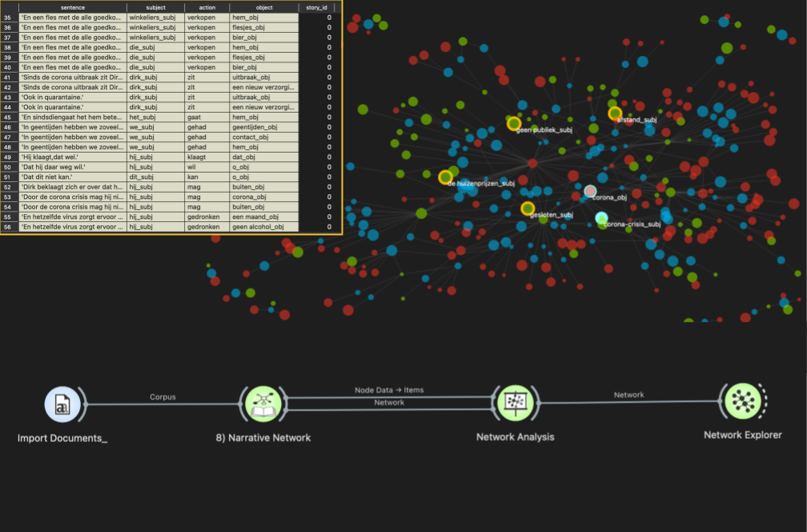

Narrative Network 
=================

An Orange3 widget to generate a network of Subject, Verb, Object tuples from each sentence in an input story written in Dutch.

**Inputs**

- Corpus: A dataset of one or more textual documents in Dutch.

**Outputs**

- SVO tuples: A data table with the following columns: 'story_id', 'sentence', 'subject', 'action', 'object' where 'story_id' is a unique number assigned to a story; 'sentence' is a sentence within the story; 'subject' is the main subject of the sentence; 'action' is the main verb associated with the subject; and 'object' is the linguistic object dependency (noun) for the 'action' and 'subject'. E.g., for the sentence "Joris parkeerde zijn auto buiten", "Joris" is the main subject, "parkeerde" is the action and "auto" is the object.
- Network: An Orange3-[Network](https://github.com/biolab/orange3-network/blob/master/orangecontrib/network/network/base.py) instance.

Example usage:
--------------

Notes:
------

The output of this widget can be processed and visualised using the [Network analysis](https://orangedatamining.com/widget-catalog/networks/networkanalysis/) and [Network explorer](https://orangedatamining.com/widget-catalog/networks/networkexplorer/) widgets available in the [Orange3-Network](https://github.com/biolab/orange3-network) add-on.