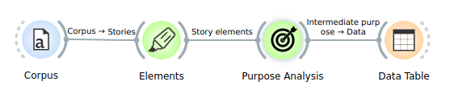
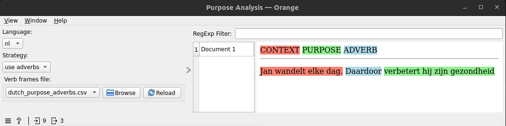
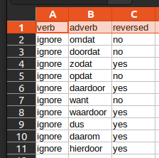
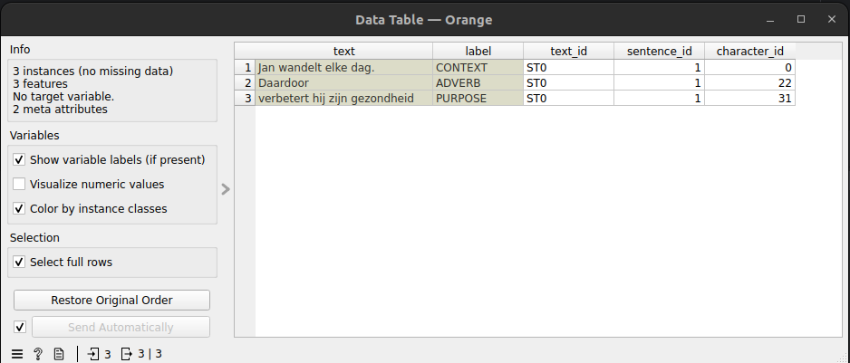

Purpose Analysis widget
=======================

**Introduction**

The Purpose Analysis widget can be used for finding the *purpose* in sentences in text. This corresponds with the 
concept with the same name in [Burke's dramatistic pentad](https://en.wikipedia.org/wiki/Dramatistic_pentad#Agency) and 
with *[final clause](https://en.wikipedia.org/wiki/Final_clause)* in linguistics. Here are two example sentences:

English: John walks every day. Thus 
he improves his health
 Dutch: Jan wandelt elke dag. Daardoor 
verbetert hij zijn gezondheid

In the English sentence, the purpose phrase is *it is good for his health*. The sentence also contains an intentionally 
performed action as context: *John walks 30 minutes everyday*. The action is linked to the purpose phrase by
an adverb (*because*). The purpose phrase is called PURPOSE in the widget, the action phrase 
CONTEXT while the conjunction is named ADVERB.

**Methods**

The identification of purpose phrases in text requires a tool which can recognize intention. As far as we know, no
such tool exists. Instead, we use an approximation based on the syntactic analysis tool [Spacy](https://spacy.io/). 
The Purpose Analysis widget offers two strategies for finding purpose phrases:

1. verbs: search for verbs like *want* to identify the purpose of the author of the text
2. adverbs: search for adverbs like *because* to find cause-effect relations in the text which could be context-purpose relations

None of these strategies work perfectly. The Purpose Analysis widget offers the users to provide lists of verbs and 
adverbs, and then select the strategy which corresponds best with their application.

**Languages**

The Purpose Analysis widget has been tested for Dutch. The verb file and adverb file need to be chosen separately from 
the language selection. Languages other than Dutch and English are not supported.

**Relations with other widgets**

The Purpose Analysis widget expects input from the *Elements* widget. The output table can be inspected in a *Data Table* 
widget.

**Screenshots**

Figure 1: The Purpose Analysis widget expects input from the Elements widget. The output table can be inspected in a Data 
Table widget

Figure 2: Purpose Analysis widget analysis of the sentence: "Jan wandelt elke dag. Daardoor verbetert hij zijn 
gezondheid". The *Browse* button can be used to select a different abverbs file

Figure 3: Contents of the file dutch_purpose_adverbs.csv

Figure 4: Output table of the Means Analysis widget for the sentence "Jan wandelt elke dag. Daardoor verbetert hij 
zijn gezondheid"

