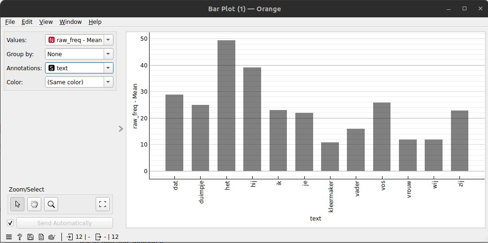

# Tutorial 1: Examining agency in a corpus of Dutch fairytales

---
This tutorial is part of a series in which several workflows are presented that demonstrate the usage of the StoryNavigator widgets. These tutorials demonstrate how to use the StoryNavigator widgets in combination with other, pre-existing widgets available within the Orange platform and how to create output via tables or figures. Each tutorial answers a research question related to the narrative structure and contents of the corpus of stories. 
---

### Step 0: Research question
In this tutorial, you will learn how to identify and analyze agency within a corpus of Dutch fairytales. We will walk through a series of steps in a predefined Orange workflow to answer two related research questions:

1. What are the most frequent agents across the entire corpus of stories?
2. What are the most frequent agents in a specific story?

We use the following workflow:

This workflow can be downloaded [here](https://github.com/navigating-stories/orange-story-navigator/tree/master/doc/widgets/workflows). In addition, it uses a dataset of 35 Dutch fairytales which can be found [here](https://github.com/navigating-stories/orange-story-navigator/tree/master/doc/widgets/fairytales/).

### Step 1: Load the corpus
To start, load the corpus of Dutch fairytales called fairytales.tab using the **Corpus** widget. This widget allows you to import and inspect your dataset.

- Task: Load your dataset (in this case, 35 Dutch fairytales) for visual inspection.
- Outcome: You will be able to visually inspect the text and make sure that your dataset is loaded correctly with the **Corpus viewer**.
  
### Step 2: Extract story elements
Next, connect **Corpus** to both the **elements** and **actors** widget. Remember, the elements widget is the 'motor' of the StoryNavigator which provides information on the texts on a token level, while the actors widget is used to extract the agents from the text.

- Task: Extract story elements like characters and actions for further analysis.
- Outcome: You now have access to story elements that are relevant to understanding agency.

### Step 3: Identify actors and agency scores
In this step, the Actors widget will allow you to focus on nouns and pronouns (actors) in the corpus and their roles in the narrative. By analyzing the subject and non-subject nouns and pronouns, you can infer agency.

- Task: Use the Actors widget to directly observe which characters or entities (subject nouns, non-subject nouns, and pronouns) appear in the text.
- Outcome: You will have a list of actors and their prominence in the story.

It is good practice to use a **DataTable** widget to inspect the data at each step of the workflow. This will help you to understand the data and the results of each widget. To zoom in on agency, use the **Select Rows** widget to get a refined selection of data. This allows you to explore agency at the story level by filtering the actors with the highest occurrence. Here, we make a selection of rows where there is a minimum amount of agency and a minimum amount of frequency occurences in the text.

### Step 4: Grouping by the entire corpus or story 
Next, we use the **GroupBy** widget to either group the data based on *storyid* and *token* if we want to know the most frequent agents in a specific story, or based on *token* if we want to know the most frequent agents across the entire corpus. Finally, we use the **DataTable** widget to inspect the results.

### Step 5: Visualizing agency
To visualize the results, we can use the **Bar Chart** widget. Connect the **GroupBy** widget to the **Bar Chart** widget and select the *frequency* column or for example the *agency* column as the variable to be plotted. The Bar Chart will show the most frequent agents in the corpus or in a specific story. We can control the amount of output in the barchart by using the **Select Rows** widget to select only the rows in which we are interested in, or else select a specific story we are interested in the dataTable directly befroe the barchart widget. The barchart updates automatically when a selection of data is made. 

## Interpreting the results and changing the set of agency words
The results can be used to answer the research questions mentioned above. For example, the results can show that the most frequent agents throughout  the corpus are 'prince', 'king', and 'queen'. The results can also show that the most frequent agents in a specific story are 'prince', 'king', and 'queen'. In case one is interested in a specific type of noun, or else do not want to include words like 'ik' 'zij' or 'hen', one can use the **Select Rows** widget to select only the rows in which the desired noun is present.