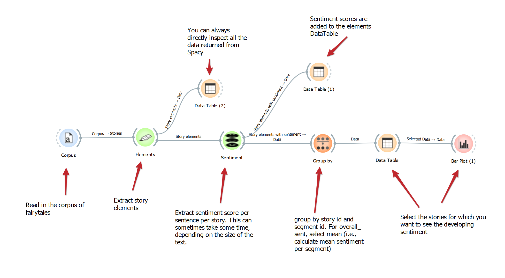
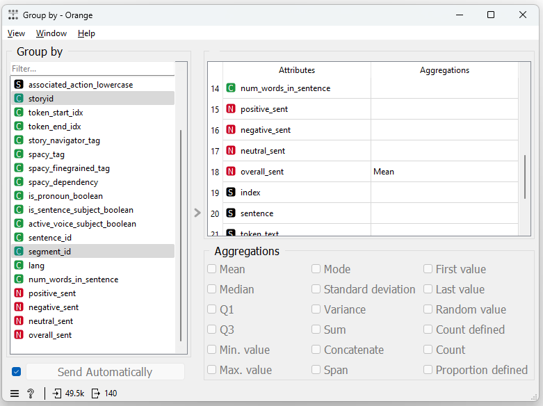
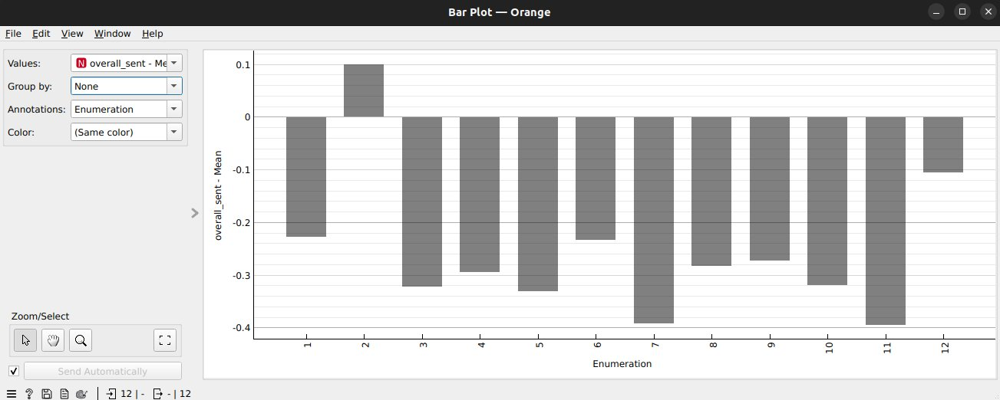

# Tutorial 2: Analyzing evolving sentiment in fairytales
=======

---
This tutorial is part of a series demonstrating the usage of StoryNavigator widgets in combination with Orange's pre-existing widgets to create output in the form of tables and figures. Here, you will learn how to track sentiment evolution within a story, based on story segments, and generate visualizations to interpret sentiment patterns across fairytales.
---

### Step 0: Research question
In this tutorial, we aim to answer the following research question:

*How does sentiment evolve over time within individual stories?*

We will achieve this by walking through a predefined Orange workflow that tracks sentiment over the different story segments, as represented in the figure below.

This workflow can be downloaded [here](https://github.com/navigating-stories/orange-story-navigator/tree/master/doc/widgets/workflows). In addition, it uses a dataset of 35 Dutch fairytales which can be found [here](https://github.com/navigating-stories/orange-story-navigator/tree/master/doc/widgets/fairytales/).

### Step 1: Load the corpus
First, use the **Corpus widget** to load the dataset of Dutch fairytales. This widget allows you to import and inspect your dataset.

- Task: Load your dataset (e.g., 35 Dutch fairytales) for visual inspection.
- Outcome: You can visually inspect the dataset using the Corpus viewer to verify that your corpus is loaded correctly.

### Step 2: Extract story elements
Next, extract story elements such as characters, actions, and story segments using the **Elements widget**. This will break down the text into manageable units, enabling sentiment analysis at the sentence or segment level.

- Task: Use the Elements widget to extract the necessary story elements, including sentences and their corresponding story IDs.
- Outcome: You'll have access to story elements organized for further analysis, structured at a granular level such as sentences or paragraphs.

### Step 3: Perform sentiment analysis
To analyze sentiment, connect the **Elements widget** to the **Sentiment widget**. The sentiment widget uses pre-trained models (such as those from SpaCy) to calculate the sentiment score of each sentence. This process might take some time depending on the corpus size.

- Task: Extract sentiment scores for each story segment (e.g., sentence) using the **Sentiment widget**.
- Outcome: The sentiment scores will be appended to each sentence/segment, representing the emotional tone over different parts of the story.
 
### Step 4: Inspect sentiment data
It's good practice to inspect the data at each stage to ensure that the sentiment scores have been added correctly. You can do this by connecting the **Sentiment widget** to the **Data Table** widget.

- Task: Use the Data Table widget to inspect the newly generated sentiment data.
- Outcome: You'll see the sentiment scores added to each story segment (e.g., sentence), ready for further grouping and visualization.

### Step 5: Group sentiment by story and segment
To track how sentiment evolves over the course of a story, use the **GroupBy widget**. Group the data by *story ID* and *segment ID* and calculate the average sentiment score per segment.

- Task: Use the **GroupBy widget** to group sentiment by story and segment ID, then calculate the mean sentiment score for each segment.
- Outcome: A new table with mean sentiment scores per story segment is generated, which will be useful for visualizing sentiment trends over time.
  

### Step 6: Visualize evolving sentiment
To visualize sentiment trends, use the **Bar Plot widget**. Connect the **GroupBy widget** output to the Bar Plot widget. This will allow you to visualize how sentiment changes across segments for a particular story or across stories.

- Task: Create a bar plot to visualize the evolving sentiment across story segments.
- Outcome: The bar plot will display the sentiment evolution in the selected story, showing positive and negative shifts in emotional tone over time.

### Step 7: Select specific stories for analysis
If you're interested in exploring sentiment evolution for specific stories, you can use the **Data Table widget** to filter the stories of interest. From here, you can refine your analysis and view sentiment trends for those selected stories in the Bar Plot.

- Task: Filter specific stories for deeper analysis.
- Outcome: You'll see the sentiment trends for the selected stories, allowing you to explore evolving sentiment on a story-by-story basis.

### Interpreting the results
Once the analysis is complete, you can interpret the visualized sentiment trends to answer the research question. The bar plots reveal how sentiment fluctuates over the course of a story, which can offer insights into the emotional journey within each fairytale.

For example, in a typical story, you might observe a general rise in positive sentiment towards the end, indicating a happy ending. Alternatively, a story may exhibit more complex emotional shifts, which could reflect dramatic tension or conflict resolution.

By using Orange's widgets to track and visualize sentiment evolution, this workflow provides a powerful approach to analyzing narrative structure and emotional tone in fairytales. You can adapt this workflow to explore sentiment patterns in other types of texts or to investigate different research questions related to storytelling and emotional content.