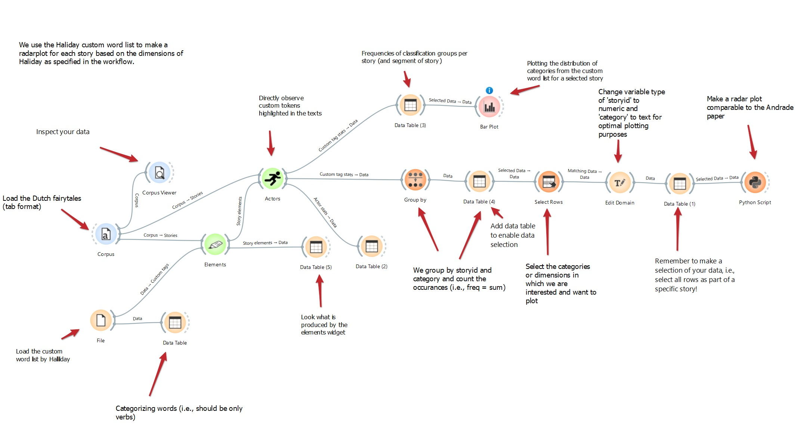
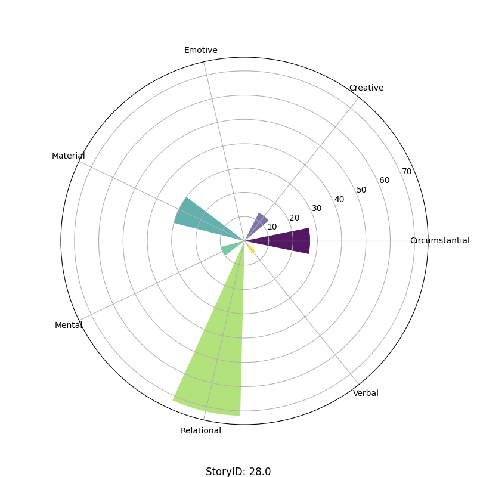

# Tutorial 3: Creating a radar plot for custom word categories in a corpus of Dutch fairytales


---
This tutorial is part of a series demonstrating the use of StoryNavigator widgets. These tutorials show how to use StoryNavigator widgets with other pre-existing widgets available within the Orange platform, and how to generate output via tables or figures. Each tutorial addresses a research question related to the narrative structure and contents of the corpus of stories.
---

### Step 0: Research question
In this tutorial, you will learn how to create a radar plot based on custom word categories in a corpus of Dutch fairytales. We will use a predefined Orange workflow to answer the following research question derived from Andrade & Andersen (2020):

- How do different categories of custom words distribute across a selected story?

We use the following workflow:



This workflow can be downloaded [here](../../doc/widgets/workflows/), and it uses a dataset of Dutch fairytales which can be found [here](../../doc/widgets/fairytales/).

### Step 1: Load the corpus
To begin, load the corpus of Dutch fairytales in tab format using the **Corpus** widget. This widget allows you to import your dataset. Use the **Corpus Viewer** to inspect the dataset.

- **Task**: Load your dataset (Dutch fairytales) for visual inspection.
- **Outcome**: You will be able to visually inspect the text and ensure that your dataset is loaded correctly with the **Corpus Viewer**.

### Step 2: Load the custom word list
Next, load the custom word list with Dutch verbs inspired by Halliday (2004) using the **File** widget which connects to the **Data Table** widget. The table contains verbs and their predefined categories.


- **Task**: Import the custom word list by Halliday.
- **Outcome**: The custom word list is loaded and ready for categorization.

### Step 3: Extract story elements
Connect the **Corpus** and the **File** widgets to the **Elements** widget to extract elements from the text. Select the appropriate word column in the elements menu to extract the custom words. 

- **Task**: Extract story elements and their categories for further analysis.
- **Outcome**: Access to categorized story elements.

### Step 4: Analyze actors
Use the **Actors** widget to directly observe custom tokens (e.g., verbs) highlighted in the texts.

- **Task**: Identify and observe custom tokens in the text.
- **Outcome**: Insight into categorized words in the text, focusing on verbs.

### Step 5: Group data
Use the **Group By** widget to group the data by story ID and Halliday category, then count the occurrences with *sum* (i.e., the freq variable).

- **Task**: Group data by story ID and category.
- **Outcome**: Frequency counts of categories for each story or segment.

### Step 6: Select Rows for Plotting
Select specific categories/ dimensions for plotting using the **Select Rows** widget.

- **Task**: Choose categories to focus on for the radar plot.
- **Outcome**: Refined data selection for plotting purposes.

### Step 7: Edit Domain
Change the variable type of the selected category for better plotting outcomes using the **Edit Domain** widget.

- **Task**: Adjust variable types for plotting.
- **Outcome**: Optimized variable types for radar plot creation.

### Step 8: Create a Radar Plot
Connect the data to a **Python Script** widget to generate a radar plot comparing the distribution of categories from the custom word list for a selected story. Note that this radarplot is not avaialbe as a standard orange widget. However, the **Python Script** widget allows you to add custom-made figures or analyses into your workflow. Copy-paste the following script for the radarplot in the editor of the **Python Script** widget:

```python
import matplotlib.pyplot as plt
import numpy as np

# Initialize the outputs
out_data = in_data
out_learner = None
out_classifier = None
out_object = None

if in_data is not None and len(in_data) > 0:  # Ensure there is data to plot
    try:
        # Extract 'category' and 'freq-sum' columns from the input data
        storyid = in_data.get_column(in_data.domain["storyid"])[0]  # Assuming storyid is the same for all rows
        categories = in_data.get_column(in_data.domain["category"])
        freq_sum = in_data.get_column(in_data.domain["freq - Sum"])
        
        # Convert categories to string
        categories = [str(cat) for cat in categories]
        
        # Number of categories
        N = len(categories)
        
        # Compute the angles for the polar bars
        angles = np.linspace(0, 2 * np.pi, N, endpoint=False).tolist()
        angles += angles[:1]  # Complete the circle for the radar plot

        # Repeat the first value to close the loop
        freq_sum = freq_sum.tolist() + [freq_sum[0]]

        # Initialize polar bar plot
        fig = plt.figure(figsize=(8, 8))
        ax = fig.add_subplot(111, polar=True)

        # Assign different colors for each bar using a colormap
        colors = plt.cm.viridis(np.linspace(0, 1, N))

        # Plot bars on the polar plot with different colors
        bars = ax.bar(angles, freq_sum, width=0.4, color=colors, alpha=0.7)

        # Set the category names as the x-ticks
        ax.set_xticks(angles[:-1])  # Exclude the last angle (repeat of the first one)
        ax.set_xticklabels(categories)

        # Optional: Customize y-axis labels or grid
        ax.yaxis.grid(True)
        
        # Display the storyID below the plot
        plt.figtext(0.5, 0.01, f'StoryID: {storyid}', ha='center', va='center', fontsize=12, color='black')

        # Display the polar bar plot
        plt.show()

    except KeyError as e:
        print(f"Error: Column '{e}' not found in the data. Check the column names.")
```

- **Task**: Generate a radar plot.
- **Outcome**: Visual representation of the distribution of categories.

Similar to the plot made in Andrade & Anderson (2020) paper, this generates the following radar plot for the selected story:



### Conclusion
By following these steps, you'll be able to create a radar plot for custom word categories in the corpus of Dutch fairytales, helping you understand how specific categories of words distribute within and across selected stories. This allows you to compare the narrative structure and contents between stories.

### References

- Andrade, S.B. and Andersen, D., (2020). Digital story grammar: a quantitative methodology for narrative analysis. *International Journal of Social Research Methodology, 23*(4), pp.405-421. https://doi.org/10.1080/13645579.2020.1723205

- Halliday, M. A. K. (2004). *An introduction to functional grammar*. London, UK: Routledge