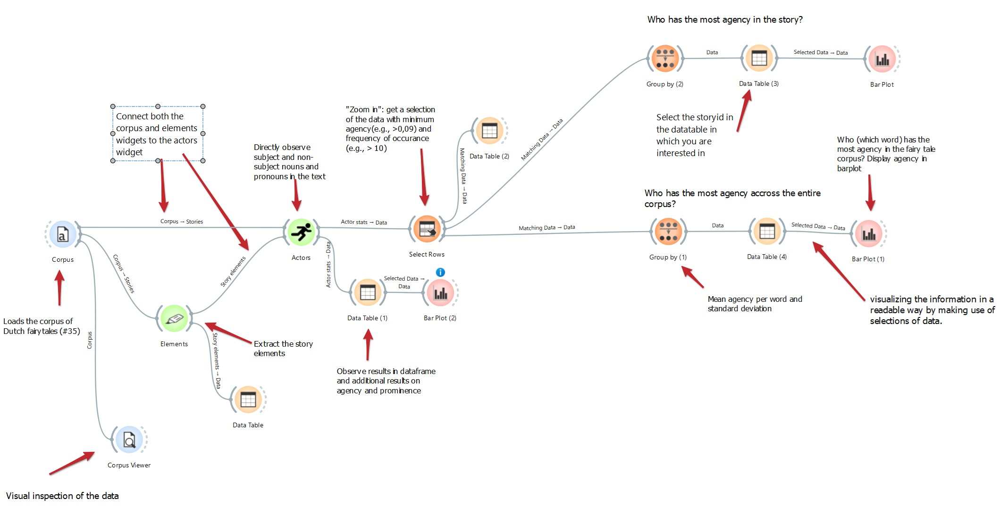

Tutorial 3
=======

These *tutorials* will provide a list of workflow examples that demonstrate the usage of the StoyNavigator widgets in order to answer some predefined research questions. Specifically, the tutorials will show how to use the widgets in combination with other, pre0existing widgets within Orange, and how to interpret the results. 

**Tutorial 1: Examining Agency**

