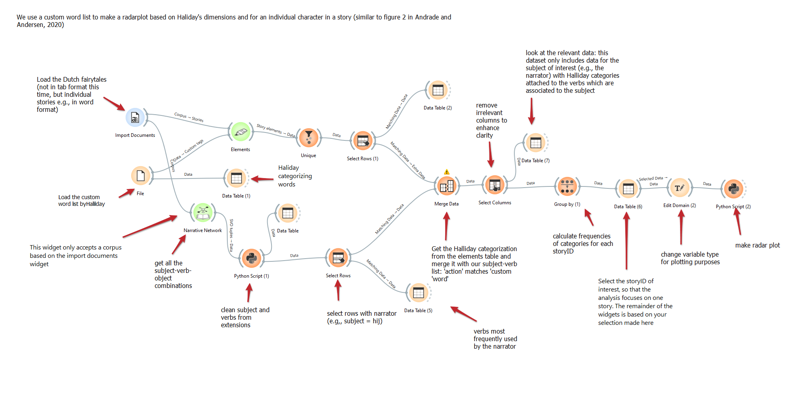
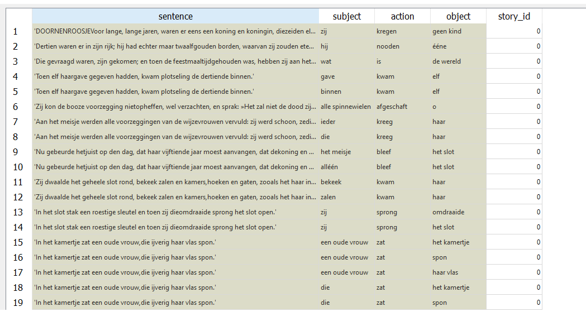
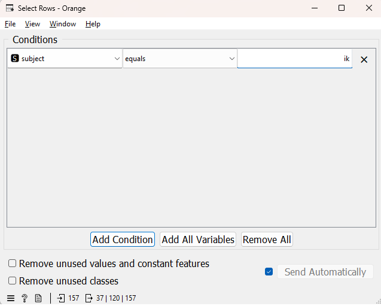
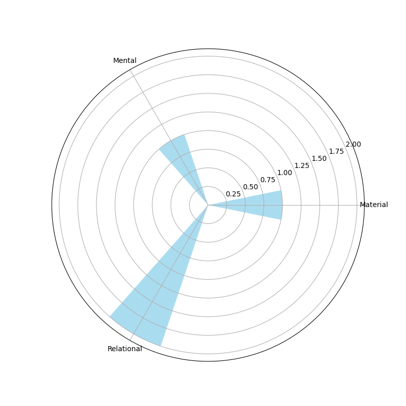

# Tutorial 4: Creating a radar plot for individual characters using custom word lists in a Dutch fairytale corpus


---
This tutorial is part of a series demonstrating the use of StoryNavigator widgets. These tutorials show how to use StoryNavigator widgets with other pre-existing widgets available within the Orange platform, and how to generate output via tables or figures. Each tutorial addresses a research question related to the narrative structure and contents of the corpus of stories.
---

### Step 0: Research question
This tutorial will guide you through the process of using Orange and StoryNavigator widgets to create a radar plot for individual characters in a story, based on predefined word categories (e.g., Halliday's dimensions). The approach is adapted from the workflow presented in Andrade & Andersen (2020).

we focus on the question:

- How do different categories of verbs, as categorized by Halliday's functional dimensions, distribute for a particular narrator or person in a story?

We use the following workflow:



This workflow can be downloaded [here](../../doc/widgets/workflows/), and it uses a dataset of Dutch fairytales which can be found [here](../../doc/widgets/fairytales/).

### Step 1: Load the Corpus
- Task: Import the corpus of Dutch fairytales in tabular format using the Import Documents widget.
- Outcome: You will be able to inspect the stories for visual validation.
- Widget: Import Documents
- Hint: Ensure the stories are properly loaded, with each document represented in the corpus.

### Step 2: Load the Custom Word List
- Task: Load the predefined custom word list inspired by Halliday's functional categories using the File widget. The file `dutch_halliday_action_list.csv` can be found  [here](../../orangecontrib/storynavigation/resources).
- Outcome: The word list will be loaded and prepared for merging with the fairytales dataset.
- Widget: File → Data Table (1)

### Step 3: Extract Subject-Verb Combinations
Task: Use the **Narrative Network widget** to extract *subject-verb combinations* from the Dutch fairytales. This will enable us to focus on the verbs used by specific narrators (e.g., “ik”).
- Outcome: Subject-verb combinations will be prepared for further analysis.
- Widget: Narrative Network → Python Script (1)
- Hint: Clean the subject-verb combinations using a Python script, removing any unnecessary extensions related to _subj or _obj using the **python script widget**. Insert the following script in the corresponding editor:

```python
from Orange.data import Table

# Assuming 'in_data' is your Orange Table object

# Extract the column indices for 'subject' and 'object'
subject_idx = in_data.domain.index('subject')
object_idx = in_data.domain.index('object')

# Loop over the rows and replace the substrings for 'subject' and 'object' columns
for row in in_data:
    if row[subject_idx] is not None:
        row[subject_idx] = row[subject_idx].value.replace('_subj', '')  # Remove '_subj' from 'subject'
    if row[object_idx] is not None:
        row[object_idx] = row[object_idx].value.replace('_obj', '')      # Remove '_obj' from 'object'

# Output modified data
out_data = in_data
```
The subject-verb-object combinations for each *story_id* look like:



### Step 4: Select Rows with a specific character
- Task: Use the Select Rows widget to filter for rows where the subject is the narrator (e.g.,"ik" or "hij").
- Outcome: After filtering, only the character’s actions (verbs) will remain which will be used to classify according to the Halliday's dimensions.
- Widget: Select Rows → Data Table (3)



### Step 5: Merge the Custom Word List with Story Elements
- Task: Merge the Halliday categorization with the subject-verb list extracted from the fairytales using the **Merge Data widget**.
- Outcome: You will have a merged dataset containing the subject, verb, and their corresponding Halliday categories.
- Take care to ensure the merge is done correctly. In this case, the verbs related to the selected narrator will determine the merge, that is: the data from the Halliday categories are *added* to the subject-verb connections. The merged dataset is equal in size to the subject-verb connections dataset.

### Step 6: Remove Irrelevant Columns and Inspect Data
- Task: Use the **Select Columns widget** to remove any unnecessary columns for clarity and further analysis.
- Outcome: A clean dataset with only relevant columns (e.g., subject, verb, Halliday category).
- Widget: Select Columns → Data Table (7)

### Step 7: Calculate Frequency of Categories
- Task: Group the data by the Halliday categories using the **Group By widget** to calculate the frequency of each category (i.e., by counting how often a category appears in the data).
- Outcome: A summary of category frequencies based on the actions of the selected narrator.
- Widget: Group By → Data Table (6)
- Hint: Ensure the grouping is by a Halliday category and that the frequency variable is aggregated using *sum* or *count*.

### Step 8: Prepare Data for Plotting
- Task: Use the **Edit Domain widget* to adjust the variable type of the Halliday category for better plotting.
- Outcome: The categories are formatted for optimal display in the radar plot.

### Step 9: Create a Radar Plot
- Task: Use the **Python Script widget** to generate a radar plot visualizing the distribution of verb categories for the selected narrator.
- Outcome: A radar plot showing the distribution of verb categories used by the narrator will be generated.
- Use the script below to generate the radar plot in the **Python Script widget**:

```python

import matplotlib.pyplot as plt
import numpy as np
import pandas as pd

out_data = in_data
out_learner = None
out_classifier = None
out_object = None

if in_data is not None:
    try:
        # Extract 'category' and 'freq-sum' columns from the input data
        categories = in_data.get_column(in_data.domain["process"])
        freq_sum = in_data.get_column(in_data.domain["process - Count"])
            
        # Combine categories with same label
        df = pd.DataFrame({'categories': categories, 'freq_sum': freq_sum})
        df_grouped = df.groupby(['categories']).sum()
        categories = list(df_grouped.index)
        freq_sum = df_grouped['freq_sum']
        
        # Convert categories to string
        categories = [str(cat) for cat in categories]
            
        # Number of categories
        N = len(categories)
            
        # Compute the angles for the polar bars
        angles = np.linspace(0, 2 * np.pi, N, endpoint=False)
            
        # Initialize polar bar plot
        fig = plt.figure(figsize=(8,8))
        ax = fig.add_subplot(111, polar=True)

        # Plot bars on the polar plot
        bars = ax.bar(angles, freq_sum, width=0.4, color='skyblue', alpha=0.7)

        # Set the category names as the x-ticks
        ax.set_xticks(angles)
        ax.set_xticklabels(categories)

        # Optional: Customize y-axis labels or grid
        ax.yaxis.grid(True)

        # Display the polar bar plot
        plt.show()

    except KeyError as e:
        print(f"Error: Column '{e}' not found in the data. Check the column names.")
```

This produces something like:



### Conclusion
By following these steps, you will be able to create a radar plot based on Halliday's word categorization, showing how a specific person in a story uses different verb types across a story. This analysis enables a deeper understanding of the person's linguistic choices, visualized clearly in the radar plot. Finally, this allows to compare different characters in the story based on their verb usage (cf. Andrade & Andersen, 2020).

### References
- Andrade, S.B. and Andersen, D. (2020). Digital story grammar: a quantitative methodology for narrative analysis. International Journal of Social Research Methodology, 23(4), 405-421.
- Halliday, M. A. K. (2004). An Introduction to Functional Grammar. Routledge.


