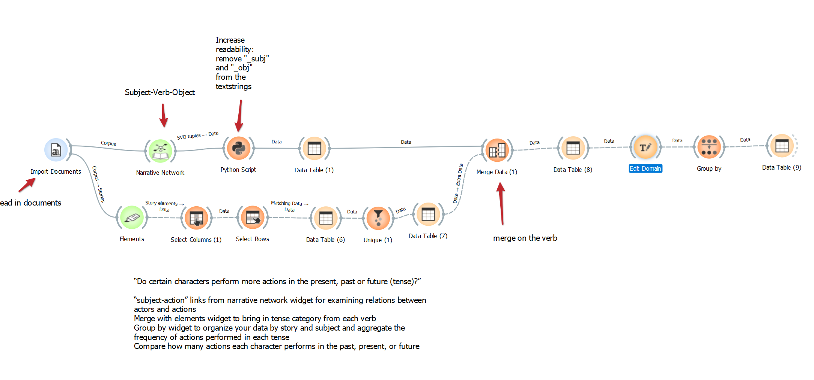
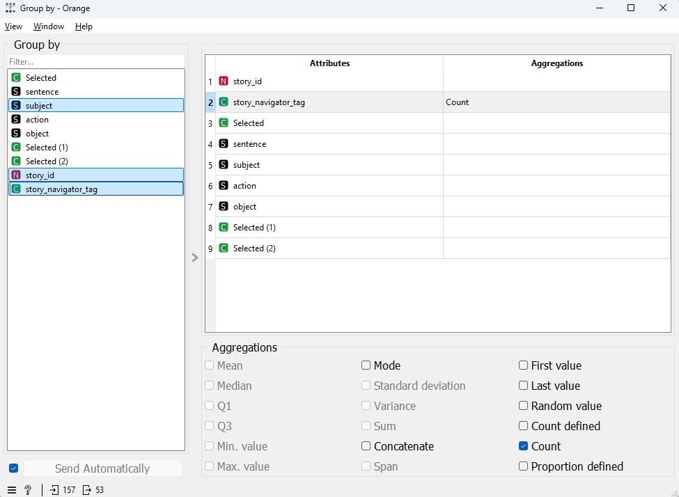

# Tutorial 6: Examining tense distribution in a narrative corpus

---
This tutorial is part of a series demonstrating the use of StoryNavigator widgets. These tutorials show how to use StoryNavigator widgets with other pre-existing widgets available within the Orange platform, and how to generate output via tables or figures. Each tutorial addresses a research question related to the narrative structure and contents of the corpus of stories.
---

### Step 0: Research Question
In this session, we will explore the distribution of tense (past, present, and future) across characters and actions within a story or corpus of stories. In adition, it shows how to combine data from multiple storynavigator widgets. The tutorial walks through each step of a predefined Orange workflow to answer the research question:

- Do characters perform more actions in the past, present, or future tense?

To answer this, we will:

- Extract subject-verb-object (SVO) tuples from a narrative corpus.
- Merge this data with tense labels for each action.
- Group the data to analyze how often actions are performed in the past, present, or future.

We use the following workflow:

This workflow can be downloaded [here](../../doc/widgets/workflows/), and it uses a dataset of Dutch fairytales which can be found [here](../../doc/widgets/fairytales/).

### Step 1: Load the Corpus
Start by loading the text corpus using the Import Documents widget.

- Task: Import the stories you wish to analyze.
- Outcome: The documents will be loaded into the workspace for further analysis.

### Step 2: Extract Subject-Verb-Object (SVO) Tuples
Next, connect the documents to the **Narrative Network widget**. This widget will analyze the text and identify *subject-verb-object (SVO) tuples* that will help you study the relationships between characters (subjects) and actions (verbs). Note that here the verb is called "action" in the Narrative Network output.

- Task: Extract SVO tuples using the Narrative Network widget.
- Outcome: A table of SVO tuples representing the relationships between characters and actions.

### Step 3: Clean the Text for Readability
We will clean up the output by using a Python Script widget to increase the readability of the extracted SVO tuples.

- Task: Use the script to remove suffixes such as "_subj" and "_obj" from the text strings in the SVO tuples.
- Outcome: A cleaner version of the SVO tuples that is easier to read.

### Step 4: Load Story Elements and Select Verb Tense
Next, connect the documents to the **Elements widget**. Ensure that the stop word removal is turned off. This widget extracts key elements including verbs and categorizes them by tense (past, present, future). We use the **Select Columns widget** to focus on the variables of interest: token_text_lowercase, storyid, and story_navigator_tag. We use the **select rows widget** to filter the data based on the tense of the verbs: "story_navigator_tag is one of PAST_VB, PRES_VB, FUTURE_VB".  Finally, we extract the unique verbs with the **unique widget** so that for each unique verb occuring in the texts we have its associated verb tense.

- Task: Select the columns containing verbs from the extracted elements and filter them based on tense.
- Outcome: A table of verbs from the text, categorized by their tense (past, present, or future). Note that, by using the **unique** widget, we ensure that each verb is represented only once. This is important for the later merging step, avoiding the situation of *many-to-many* merging.

### Step 5: Merge the SVO Data with Verb Tense Information
Now, merge the extracted SVO data (subject-verb-object) with the tense information from the Elements widget. Use the **Merge Data** widget to do this, matching on the verb column. Take care to ensure the merge is done correctly. In this case, the information on the tense of each verb is *added* to the subject-verb-object connections. The merged dataset is then equal in size to the subject-verb-object connections dataset.

- Task: Use the **Merge Data widget** to combine the *SVO data* with the verb tense data based on the shared verb column.
- Outcome: A combined table where each verb from the SVO tuples is linked to its corresponding tense.

### Step 6: Group Data by Story and Tense
Once the data has been merged, use the **Group By widget** to organize the data by *story_id*, *subject* and *tense* (see image below). This will allow us to group actions performed in different tenses (past, present, or future) for each character in each story.

- Task: Group the data by the verb tense to aggregate the number of actions performed in the past, present, or future for each character.
- Outcome: An aggregated table that shows how often characters perform actions in each tense.

### Step 7: Visualizing Tense Distribution
You can now visualize the distribution of actions in each tense using a **Bar Chart widget**. Select the appropriate column to show the number of actions performed in each tense (past, present, future).

- Task: Use the Bar Chart widget to visualize the frequency of actions in each tense.
- Outcome: A bar chart that displays the distribution of tense usage across the corpus or within specific stories.

### Step 8: Analyzing the Results
The results can help you answer the research question regarding tense distribution. For example, you can compare whether certain characters perform more actions in the past, present, or future compared to other characters in the story, or even compare across the entire corpus. If desired, refine your analysis by selecting rows with specific tenses or characters using the **Select Rows widget**. You can also decide to test for significant differences in tense usage between characters or stories.

By following these steps, you will be able to analyze the distribution of tense within a narrative corpus and understand how characters interact with different timelines in the stories.